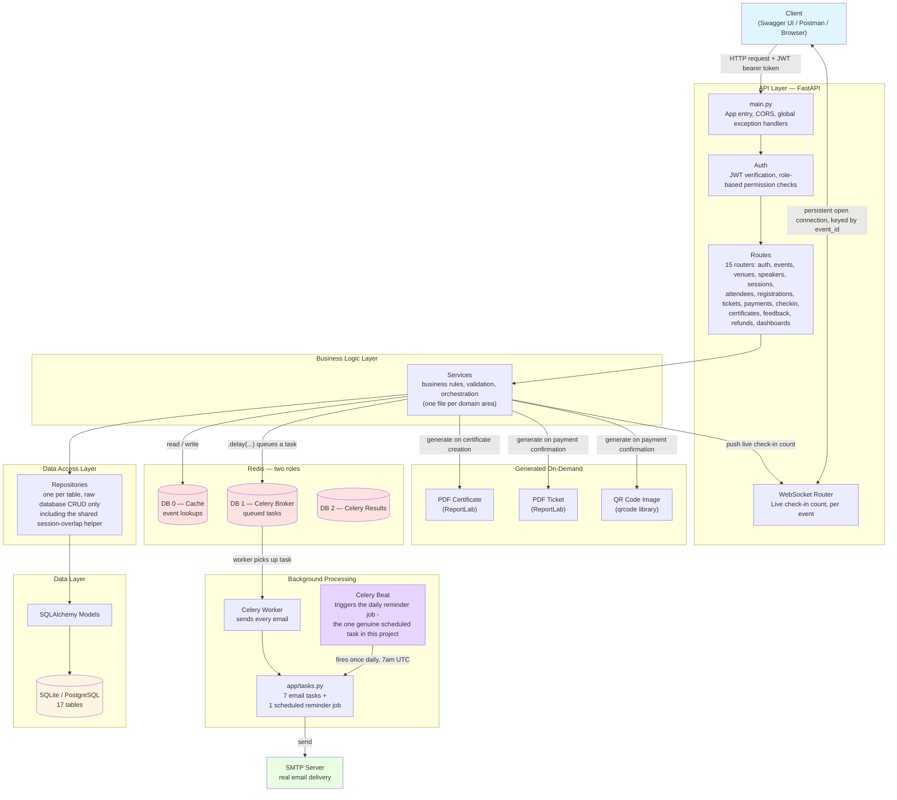

# Architecture Diagram — Event & Conference Management System

This shows how a request actually travels through the whole system, layer by
layer, plus how background processing (Celery, including a real scheduled
job this time), live updates (WebSocket), and file generation (PDF, QR) all
fit in. GitHub renders this automatically — no separate image needed.

---

## What each layer actually does, in plain words

**Client** — Swagger, Postman, or a real frontend. Sends a normal HTTP
request with a JWT token attached, or opens a WebSocket connection to watch
one specific event's check-in count live.

**`main.py`** — the very first thing every request hits. Handles CORS, and
catches any error anywhere in the app, turning it into a clean, consistent
JSON response.

**Auth** — checks the JWT token is genuine and not expired, and figures out
which role the person is (Admin, Event Organizer, Speaker, Staff, or
Attendee) — every route then decides whether that specific role is allowed
in. Also eagerly loads both the Speaker and Attendee profile relationships
in one query here, avoiding the same N+1 pattern found and fixed in an
earlier project, built in correctly from the start this time.

**Routes** — the actual URL endpoints. Their only job is receiving the
request and handing it straight to the matching service.

**Services** — this is where the real thinking happens: every business rule
in this whole project lives here, including some genuinely intricate ones —
the shared hall/speaker overlap-checking logic reused across session
creation and updates, the tiered refund percentage calculation, and the
2-step payment confirmation flow that makes "failed payments don't confirm
purchases" an actually-testable rule rather than an assumption.

**Repositories** — the layer whose *only* job is talking to the database.

**Models** — the SQLAlchemy classes describing what each table looks like.

**Redis, two roles** — caching event reads, and holding Celery's task queue
and results, same lighter-touch caching approach as the food delivery
platform: only the single most frequently-read, infrequently-changed
resource (Event) gets cached.

**Celery Worker** — sends every real email in this system.

**Celery Beat, genuinely present this time** — worth calling out clearly,
since it's a real difference from at least one earlier project in this
series: this platform has a genuine recurring need (checking every day for
events and sessions starting soon, to send reminder emails), so Beat fires
once daily and hands the actual work to the worker.

**PDF and QR generation** — 3 different generated files this time: a
certificate (generated the moment attendance is verified and a certificate
is requested), a ticket (generated the moment payment is genuinely
confirmed), and a QR code image (generated at that same moment, encoding the
registration's own reference, later decoded by the check-in verification
endpoint).

**WebSocket** — keyed by `event_id` this time, not by an individual order —
anyone watching a specific event's check-in desk (an organizer, multiple
staff at different doors) all see the same live, running check-in count
update together.

---

## A concrete example — what happens when an attendee's payment is confirmed

1. Attendee calls `PATCH /payments/{id}/status?is_success=true`
2. **Services** verifies the payment is genuinely still `PENDING`, not
   already resolved
3. The payment flips to `SUCCESS`, the purchase flips to `CONFIRMED`, and the
   registration flips to `CONFIRMED` too — one cascading update, all in the
   same transaction
4. A **payment success email** gets queued into **Redis (DB 1)**
5. A real **PDF ticket** gets generated immediately, right there in the
   request
6. A **ticket confirmation email**, with that PDF attached, gets queued too
7. A real **QR code image** gets generated, encoding this registration's own
   reference — ready for the attendee to show at the door later
8. The API responds to the attendee **immediately** — it doesn't wait for
   either email to actually send
9. Moments later, the **Celery Worker**, running as a separate process,
   picks up both queued email tasks and sends them through the real **SMTP
   server**
10. Days or weeks later, when the attendee actually arrives and shows their
    QR code, `POST /check-in/verify-qr` decodes that same image, finds this
    exact registration, and pushes a **live update** through the WebSocket
    connection to anyone watching that event's check-in desk right now

## How to view this diagram

- **On GitHub:** opens automatically when viewing this file in your
  repository
- **Locally:** paste the code block into [mermaid.live](https://mermaid.live)
  to preview or export it as an image