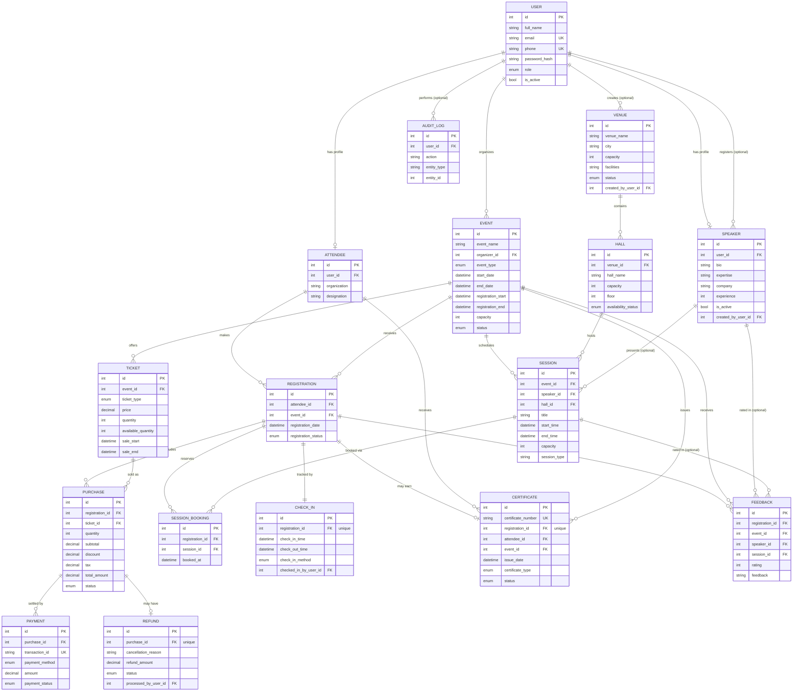

# ER Diagram — Event & Conference Management System

This diagram shows all 17 tables and how they connect. GitHub renders this
automatically when viewing this file in a repository — no separate image or
tool needed. Full field lists for every table are in `app/models/` and the
Alembic migration file.

---

## Relationships explained in plain words

- **One User can have one Speaker profile, and separately, one Attendee
  profile** — a single account only ever holds one of these, matching its
  role, but the schema itself allows both relationships from `User`.
- **One User (an Event Organizer) can organize many Events**, and optionally
  create Venues and register Speakers (both tracked by `created_by_user_id`,
  since Admin can also do both).
- **One Venue contains many Halls.**
- **One Event schedules many Sessions**; each Session belongs to exactly one
  Hall and, optionally, one Speaker (a session's speaker can be assigned
  later, so it stays nullable).
- **One Attendee makes many Registrations, one per Event** (a real database
  constraint prevents registering for the same event twice).
- **One Registration branches into several things:** one or more Purchases
  (buying tickets), any number of Session Bookings (reserving seats at
  specific talks), exactly **one** Check-In record (created the moment
  registration happens, updated — never duplicated — when the attendee
  actually arrives), at most **one** Certificate, and any number of Feedback
  submissions.
- **One Purchase branches into Payments (typically one) and at most one
  Refund** — both enforced through real database constraints where the task
  calls for "one" of something (unique transaction IDs, one refund per
  purchase).
- **Feedback deliberately allows 3 different, independent targets** — always
  tied to an Event, and optionally narrowing down to a specific Speaker or
  Session, matching the task's own "rate Event, Speaker, or Session"
  wording rather than forcing all 3 into one fixed combination every time.

## How to view this diagram

- **On GitHub:** just open this file in your repository — it renders
  automatically, no setup needed.
- **Locally, before pushing:** paste the code block above (without the triple
  backticks) into [mermaid.live](https://mermaid.live) to preview it instantly.